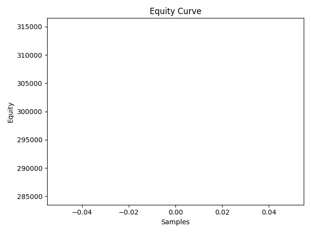

# Daily Report (EQ)

Symbols: RELIANCE, TCS, INFY
Broker: paper
Trades taken: 0
PnL (est): 0.00

## Orders

## Logs
- {'load_config': {'segment': 'EQ', 'symbols': ['RELIANCE', 'TCS', 'INFY']}}
- {'seed_history': {'source': 'broker', 'symbols': ['RELIANCE', 'TCS', 'INFY']}}
- {'open_live': '2025-10-06T23:25:05.725350+05:30'}
- {'stop_new_entries': '2025-10-06T23:25:06.092973+05:30'}
- {'flatten_positions': '2025-10-06T23:25:06.094850+05:30'}
- {'summarize_day': {'realized': 0.0, 'unrealized': 0.0, 'equity': 300000.0, 'max_drawdown': 0.0}}
- {'send_report': {'file': 'day_report.md', 'chart': 'equity_curve.png', 'delivery': {'email': {'email': 'disabled'}, 'slack': {'slack': 'disabled'}}}}
- {'load_config': {'segment': 'EQ', 'symbols': ['RELIANCE', 'TCS', 'INFY']}}
- {'seed_history': {'source': 'broker', 'symbols': ['RELIANCE', 'TCS', 'INFY']}}
- {'open_live': '2025-10-06T23:25:10.379118+05:30'}
- {'stop_new_entries': '2025-10-06T23:25:10.808817+05:30'}
- {'flatten_positions': '2025-10-06T23:25:10.809392+05:30'}
- {'summarize_day': {'realized': 0.0, 'unrealized': 0.0, 'equity': 300000.0, 'max_drawdown': 0.0}}
- {'send_report': {'file': 'day_report.md', 'chart': 'equity_curve.png', 'delivery': {'email': {'email': 'disabled'}, 'slack': {'slack': 'disabled'}}}}
- {'load_config': {'segment': 'EQ', 'symbols': ['RELIANCE', 'TCS', 'INFY']}}
- {'seed_history': {'source': 'broker', 'symbols': ['RELIANCE', 'TCS', 'INFY']}}
- {'open_live': '2025-10-06T23:25:11.167774+05:30'}
- {'stop_new_entries': '2025-10-06T23:25:11.565738+05:30'}
- {'flatten_positions': '2025-10-06T23:25:11.566230+05:30'}
- {'summarize_day': {'realized': 0.0, 'unrealized': 0.0, 'equity': 300000.0, 'max_drawdown': 0.0}}
- {'send_report': {'file': 'day_report.md', 'chart': 'equity_curve.png', 'delivery': {'email': {'email': 'disabled'}, 'slack': {'slack': 'disabled'}}}}
- {'load_config': {'segment': 'EQ', 'symbols': ['RELIANCE', 'TCS', 'INFY']}}
- {'seed_history': {'source': 'broker', 'symbols': ['RELIANCE', 'TCS', 'INFY']}}
- {'open_live': '2025-10-06T23:25:11.952957+05:30'}
- {'stop_new_entries': '2025-10-06T23:25:12.342463+05:30'}
- {'flatten_positions': '2025-10-06T23:25:12.343286+05:30'}
- {'summarize_day': {'realized': 0.0, 'unrealized': 0.0, 'equity': 300000.0, 'max_drawdown': 0.0}}
- {'send_report': {'file': 'day_report.md', 'chart': 'equity_curve.png', 'delivery': {'email': {'email': 'disabled'}, 'slack': {'slack': 'disabled'}}}}
- {'load_config': {'segment': 'EQ', 'symbols': ['RELIANCE', 'TCS', 'INFY']}}
- {'seed_history': {'source': 'broker', 'symbols': ['RELIANCE', 'TCS', 'INFY']}}
- {'open_live': '2025-10-06T23:25:12.747105+05:30'}
- {'stop_new_entries': '2025-10-06T23:25:13.146711+05:30'}
- {'flatten_positions': '2025-10-06T23:25:13.147243+05:30'}
- {'summarize_day': {'realized': 0.0, 'unrealized': 0.0, 'equity': 300000.0, 'max_drawdown': 0.0}}
- {'send_report': {'file': 'day_report.md', 'chart': 'equity_curve.png', 'delivery': {'email': {'email': 'disabled'}, 'slack': {'slack': 'disabled'}}}}
- {'load_config': {'segment': 'EQ', 'symbols': ['RELIANCE', 'TCS', 'INFY']}}
- {'seed_history': {'source': 'broker', 'symbols': ['RELIANCE', 'TCS', 'INFY']}}
- {'open_live': '2025-10-06T23:25:13.591267+05:30'}
- {'stop_new_entries': '2025-10-06T23:25:14.041310+05:30'}
- {'flatten_positions': '2025-10-06T23:25:14.041717+05:30'}
- {'summarize_day': {'realized': 0.0, 'unrealized': 0.0, 'equity': 300000.0, 'max_drawdown': 0.0}}
- {'send_report': {'file': 'day_report.md', 'chart': 'equity_curve.png', 'delivery': {'email': {'email': 'disabled'}, 'slack': {'slack': 'disabled'}}}}
- {'load_config': {'segment': 'EQ', 'symbols': ['RELIANCE', 'TCS', 'INFY']}}
- {'seed_history': {'source': 'broker', 'symbols': ['RELIANCE', 'TCS', 'INFY']}}
- {'open_live': '2025-10-06T23:25:14.422637+05:30'}
- {'stop_new_entries': '2025-10-06T23:25:14.751856+05:30'}
- {'flatten_positions': '2025-10-06T23:25:14.752284+05:30'}
- {'summarize_day': {'realized': 0.0, 'unrealized': 0.0, 'equity': 300000.0, 'max_drawdown': 0.0}}
- {'send_report': {'file': 'day_report.md', 'chart': 'equity_curve.png', 'delivery': {'email': {'email': 'disabled'}, 'slack': {'slack': 'disabled'}}}}
- {'load_config': {'segment': 'EQ', 'symbols': ['RELIANCE', 'TCS', 'INFY']}}
- {'seed_history': {'source': 'broker', 'symbols': ['RELIANCE', 'TCS', 'INFY']}}
- {'open_live': '2025-10-06T23:25:15.121069+05:30'}
- {'stop_new_entries': '2025-10-06T23:25:15.570293+05:30'}
- {'flatten_positions': '2025-10-06T23:25:15.571118+05:30'}
- {'summarize_day': {'realized': 0.0, 'unrealized': 0.0, 'equity': 300000.0, 'max_drawdown': 0.0}}

